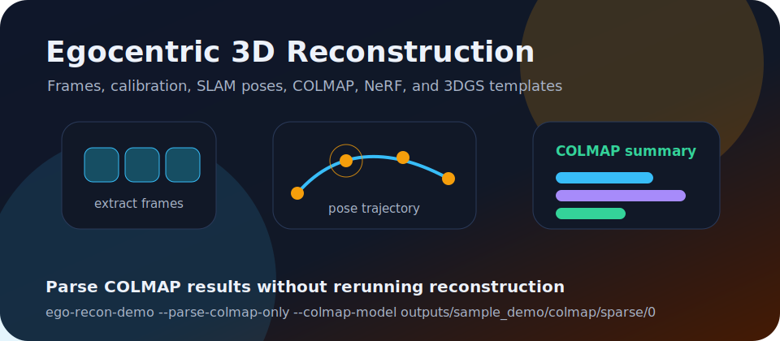
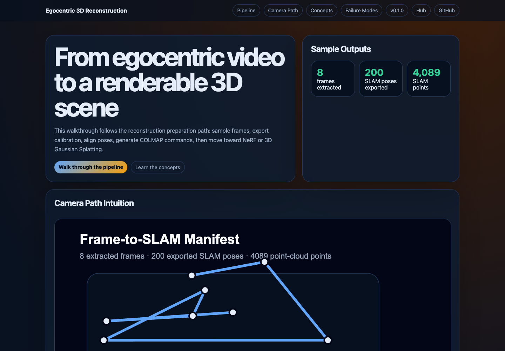

# Egocentric 3D Reconstruction Demo

[](https://github.com/ChaoYue0307/egocentric-3d-reconstruction-demo/actions/workflows/ci.yml)

Learn the moving parts behind 3D reconstruction from first-person video:
frames, camera calibration, SLAM poses, COLMAP, NeRF, and 3D Gaussian Splatting.

Part of the Egocentric Vision Learning Hub:
https://chaoyue0307.github.io/egocentric-vision-learning-hub/

The script prepares the ingredients that reconstruction systems need. It
extracts video frames, exports camera calibration, writes a SLAM trajectory,
generates COLMAP and neural-rendering command templates, and explains common
failure cases for egocentric footage.





## Interactive Tutorial

Open the visual walkthrough:

- Web page: https://chaoyue0307.github.io/egocentric-3d-reconstruction-demo/
- Local copy: open `docs/index.html` in a browser.

The page includes a stage-by-stage pipeline, a camera-path visual, command map,
interactive concept explanations, and failure-mode checklist.

## What You Will Learn

- **Frame extraction:** turning a video into images that reconstruction tools can match.
- **Camera calibration:** intrinsics, distortion, and extrinsics that describe each camera.
- **SLAM pose:** an estimated camera path through 3D space.
- **COLMAP:** feature matching plus bundle adjustment to estimate cameras and sparse points.
- **NeRF:** a neural field that learns density and color for novel-view rendering.
- **3D Gaussian Splatting:** a point-based neural renderer that can produce fast novel views.
- **Failure analysis:** why motion blur, dynamic hands, fisheye distortion, and weak overlap matter.

## Data

Raw videos, `annotation.hdf5`, and `.rrd` files stay outside git. Set
`DATA_ROOT` to your local Xperience-10M sample:

```bash
export DATA_ROOT=/path/to/xperience-10m-sample
```

The expected directory contains `annotation.hdf5` and camera videos such as
`fisheye_cam0.mp4`.
See `DATA_NOTICE.md`, `DATA_CARD.md`, and `EVALUATION_CARD.md` for the data contract, intended use, outputs, and limitations.

## Run The Preparation Script

```bash
python3 -m venv .venv
source .venv/bin/activate
pip install -r requirements.txt

python scripts/reconstruction_demo.py \
  --data-root "$DATA_ROOT" \
  --output-dir outputs/sample_demo \
  --frame-stride 180 \
  --max-frames 24
```

This command does not require COLMAP, NeRFStudio, or 3DGS to be installed. It
checks whether those tools are available and still writes the tutorial artifacts.

After installing the project, the same CLI is available as:

```bash
pip install -e .
ego-recon-demo --data-root "$DATA_ROOT" --output-dir outputs/sample_demo
```

If you already ran COLMAP and have a sparse text model, parse it without
touching the raw sample data:

```bash
ego-recon-demo \
  --parse-colmap-only \
  --colmap-model outputs/sample_demo/colmap/sparse/0 \
  --output-dir outputs/sample_demo
```

When `frames_manifest.json` is present, the parser also writes a lightweight
COLMAP-vs-SLAM pose comparison.

To verify whether COLMAP is installed and run the generated commands when it is
available:

```bash
python scripts/run_colmap_if_available.py --run
```

## Repository Map

| Path | Purpose |
| --- | --- |
| `scripts/reconstruction_demo.py` | frame extraction, calibration export, SLAM export, and command generation |
| `scripts/adapters.py` | source boundary for video, calibration, and pose providers |
| `notebooks/02_reconstruction_artifacts.ipynb` | step-by-step notebook companion |
| `reports/reconstruction_readiness_report.md` | paper-style method, artifact, and limitation summary |
| `docs/index.html` | interactive reconstruction tutorial webpage |
| `docs/concepts.md` | glossary for reconstruction and neural rendering terms |
| `outputs/sample_demo/calibration.json` | sample calibration export |
| `outputs/sample_demo/failure_analysis.md` | reconstruction failure-mode checklist |

## Common Commands

```bash
make test
make help
make visuals
make pages
```

## Outputs

| Output | Why It Matters |
| --- | --- |
| `frames/` | sampled JPEG images used as reconstruction input |
| `calibration.json` | camera intrinsics, distortion, and rig transforms |
| `slam_poses_tum.txt` | camera trajectory in a common TUM-like text format |
| `slam_point_cloud_preview.ply` | lightweight preview of the existing SLAM point cloud |
| `frame_contact_sheet.svg` | visual index of extracted frames and nearest SLAM poses |
| `colmap_commands.sh` | COLMAP feature, matching, mapping, and undistortion commands |
| `colmap_summary.json` / `colmap_summary.svg` | optional summary of a parsed COLMAP sparse model |
| `colmap_vs_slam.json` / `colmap_vs_slam.svg` | optional trajectory comparison against nearest SLAM poses |
| `colmap_run_report.json` / `colmap_run_report.md` | local COLMAP availability and execution report |
| `nerf_3dgs_templates.sh` | command templates for NeRFStudio and Gaussian Splatting |
| `failure_analysis.md` | checklist for diagnosing egocentric reconstruction failures |

## Reading The Pipeline

1. Extract frames from the egocentric video.
2. Use calibration to understand how pixels map to camera rays.
3. Use COLMAP to match visual features and optimize camera poses.
4. Use NeRF or 3DGS to learn a renderable 3D representation.
5. Render novel views and compare them with the SLAM trajectory.

Egocentric video is difficult because the scene is not fully static: hands,
kettle, water, and coffee tools move while the camera moves too. Treat these
moving regions carefully when moving from this preparation step to full
reconstruction.
